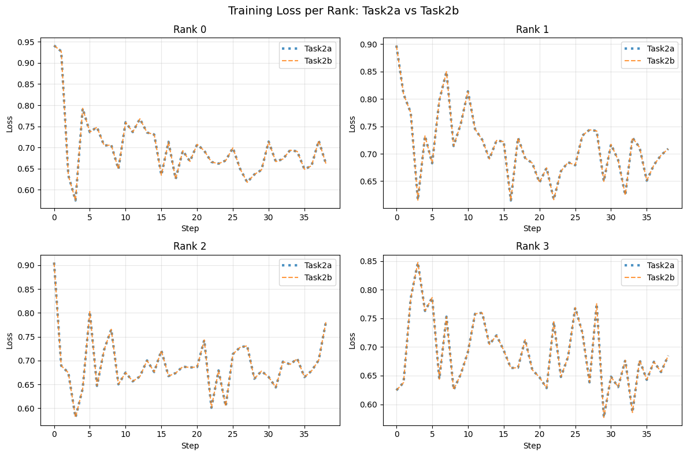
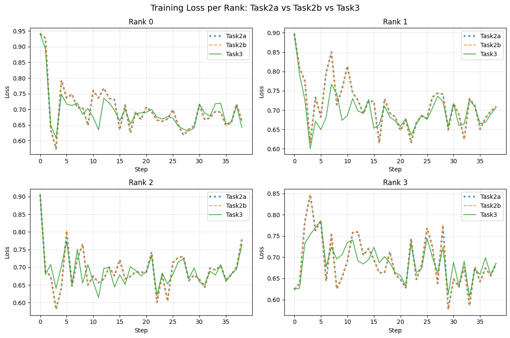
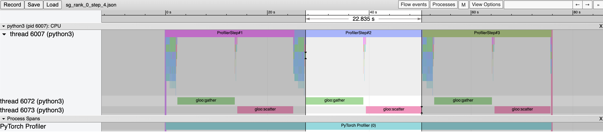
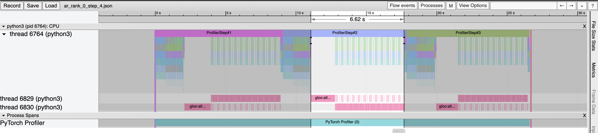
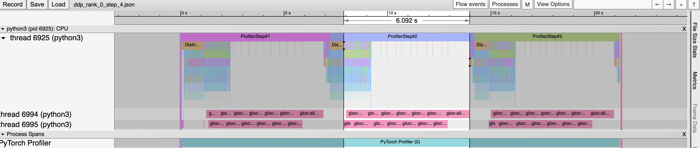

## Assignment 2: Distributed Training of Language Models

Mike Neuder, COS 568, Spring 2026

### Task 1

The first task only required small code changes to `run_glue.py`. 

- The model is loaded from hugging face using the arg passed in the CLI flags
```
model = model_class.from_pretrained(args.model_name_or_path, config=config)
```
- The backward pass is the following method on the loss object
```
loss.backward()
```
- The optimizer step can be called directly
```
optimizer.step()
```
- The evaluation method is simply
```
evaluate(args, model, tokenizer)
```

The loss of the first five minibatches is:

```
step 0, loss 0.7691709399223328
step 1, loss 0.7817339301109314
step 2, loss 0.6885837912559509
step 3, loss 0.7662752866744995
step 4, loss 0.7341869473457336
```

And the per-epoch accuracies for the three epochs of training are 

```
03/06/2026 19:26:48 - INFO - __main__ -     acc = 0.628158844765343
03/06/2026 19:30:57 - INFO - __main__ -     acc = 0.6498194945848376
03/06/2026 19:35:09 - INFO - __main__ -     acc = 0.6209386281588448
```

### Task 2

#### Part A

In task 2, we run for a single epoch with the following extra CLI flags

```
  --master_ip  10.10.1.2 \
  --master_port 12345 \
  --world_size 4 \
  --local_rank 0
```

where we change the local rank based on the node we are running on. We also modify the batch size to 16 examples per minibatch per machine
```
--per_device_train_batch_size 16
```

We implement the gather-scatter as follows. First we flatten the gradients object, before gathering all of the separate values on the rank 0 node. Then we take the average over them all before scattering them back out to nodes 1,2,3. The following code implements this. 
```
if args.local_rank != -1:
    grads = [p.grad for p in model.parameters()]
    flat = torch.cat([g.flatten() for g in grads])

    if args.local_rank == 0:
        gather_list = [torch.zeros_like(flat) for _ in range(args.world_size)]
    else:
        gather_list = None
    torch.distributed.gather(flat, gather_list, dst=0)

    if args.local_rank == 0:
        avg_flat = torch.stack(gather_list).mean(dim=0)
        scatter_list = [avg_flat.clone() for _ in range(args.world_size)]
    else:
        scatter_list = None
    torch.distributed.scatter(flat, scatter_list, src=0)

    # Unflatten back into individual gradients
    offset = 0
    for p in model.parameters():
        numel = p.grad.numel()
        avg_grad = torch.reshape(flat[offset:offset + numel], p.grad.shape)
        p.grad = avg_grad
        offset += numel
```

Further, we need to use `DistributedSampler` to partition the data into groups of 16. I added a timing loop that measures the iteration time of each except the first minibatch with the following code.

```
if step > 0:
    iter_times.append(time.time() - iter_start)
```
and get an average time over the 38 iterations of:

```
Average time per iteration: 24.781s (38 iterations)
```

Further, I collect the loss at each step for each node and plot it on a 2x2 grid:



Notice that since we used the same seed and configuration, the losses are identical between the Part A and Part B runs (both plotted in the figure). 

#### Part B

The code here is much simpler than the manual scatter gather in Part A. The builtin function of `all_reduce` allows us to implement the gradient averaging across the nodes in the following lines of code:

```
for p in model.parameters():
    torch.distributed.all_reduce(p.grad, op=torch.distributed.ReduceOp.SUM)
    p.grad /= args.world_size
```

With a much shorter average runtime:
```
Average time per iteration: 9.404s (38 iterations)
```

The loss is shown in the figure above to be exactly the same as in Part A. 

### Task 3

This version of the code simply registers the model as DistributedDataParallel with the following code:

```
if args.local_rank != -1:
    model = DistributedDataParallel(model)
```

with an average iteration time 

```
Average time per iteration: 7.877s (38 iterations)
```

The loss is shown below with the other tasks



Clearly the loss is taking the same shape, but isn't numerically exactly the same as Task 2A/2B. I believe this is due to the fact that the ordering of the addition operations is reversed and bucketed into separate chunks (because the last weights are shared first) and since floating point operations are not associative, there is a slight numerical mismatch between the forward addition version of GatherScatter/AllReduce and DDP. The communication ordering is described in Section 3.2.3 of https://arxiv.org/pdf/2006.15704.

### Task 4

The profiles for GatherScatter, AllReduce, and DDP are shown below:

GatherScatter


The percentage of communication time over the total time for each step is 

```
1. 22.8s out of 25.3s = 90%
2. 22.8s out of 25.3s = 90%
3. 22.8s out of 25.3s = 90%
```
It is pretty remarkable how consistent each step is in the profile, down to the tenth of a second. And with 90% of the time spent communicating, we can see that scatter gather is very slow.


---

AllReduce


The percentage of communication time over the total time for each step is 

```
1. 6.8s out of 9.1s = 75%
2. 6.6s out of 9.1s = 73%
3. 6.5s out of 8.7s = 75%
```
Now the communication is a much smaller portion of the overall time. Here, the computation still takes about 2.5s of the total time, but the communication is greatly reduced. This reduction comes from the fact that the all reduce parallelizes the communication, versus the sequential version in gather scatter.

---

DDP


The percentage of communication time over the total time for each step is 

```
1. 5.6s out of 7.2s = 78%
2. 6.1s out of 7.2s = 85%
3. 6.0s out of 7.0s = 86%
```

Here, the communication starts before the backwards pass completes, so some of the communication is parallelized with the computation. This makes the overall iteration time even faster (about 20% faster than AllReduce).

---

#### Discussion

GatherScatter is exceedingly slow for a few reasons. First is the lack of parallelism. It runs the full gather before starting the scatter and does all of the processing on Node 1. The process of averaging among the four nodes per weight is highly parallelizable. Second, the load is fully done on Node 1, so the bottleneck is the network speed getting all the data into and out of that machine. AllReduce and DDP split up the work much more efficiently by both parallelizing the averaging task and by distributing the work over all four nodes which then share among eachother. This utilizes the network resources more evenly which is why AllReduce and DDP are so much faster. 

Regarding DDP and AllReduce: DDP is more efficient than AllReduce. The average AllReduce iteration time is 8.97, while the average DDP iteration time is 7.13, which means DDP is on average

(8.97-7.13)/8.97 = 21% faster.  

This efficiency comes from the fact that the communication overlaps with the computation by starting before the backward pass fully completes. The intuition here is that the weights that have already been updated (farther into the network) can be communicated while the gradients are passed backwards through the network. DDP uses a reverse ordering heuristic, where the farthest back weights in the network are communicated first, which they discuss in Section 3.2.3 of https://arxiv.org/pdf/2006.15704.